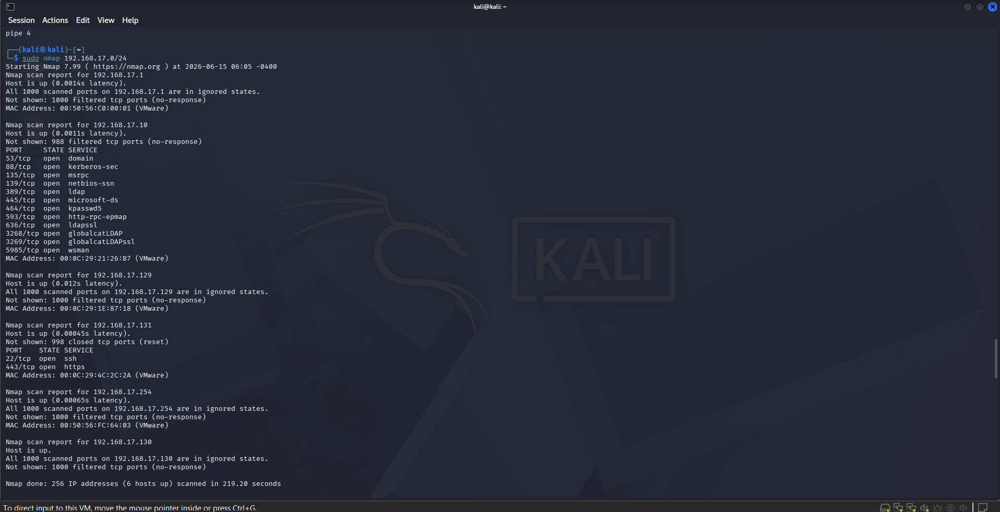
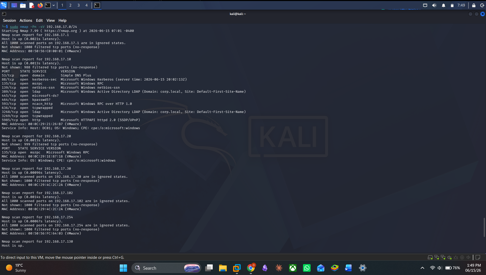
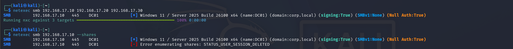
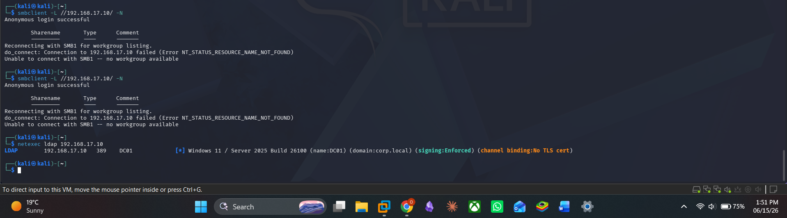
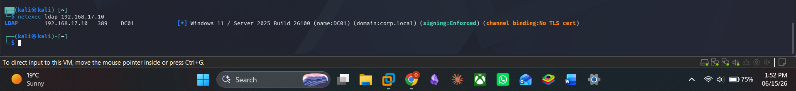

# PNPT-PREPARATION

# Active Directory Home Lab for PNPT Preparation - Phase 1

## Overview

This project documents the creation of a realistic Active Directory home lab designed to support preparation for the Practical Network Penetration Tester (PNPT) certification.

The goal was to build an environment that closely resembles a small enterprise network where both defensive and offensive security skills can be practiced.

The lab includes:

* Windows Server Domain Controller (DC01)
* Windows 11 Domain-Joined Workstation (WIN11-CLIENT)
* Kali Linux Attacker Machine
* Ubuntu Wazuh Server
* Active Directory Domain Services (AD DS)
* DNS
* Organizational Units (OUs)
* Security Groups
* Shared Folders
* Simulated Enterprise Users

---

## Lab Architecture

### Virtual Machines

| Machine      | Role               | IP Address     |
| ------------ | ------------------ | -------------- |
| DC01         | Domain Controller  | 192.168.17.10  |
| WIN11-CLIENT | Domain Workstation | DHCP           |
| Kali Linux   | Attacker Machine   | 192.168.17.101 |
| Ubuntu Wazuh | SIEM Platform      | DHCP           |

### Network Design

Kali Linux uses two network adapters:

* Host-Only Adapter (VMnet1) for attacking the lab
* NAT Adapter for internet access

All Windows systems remain isolated inside the Host-Only network.

This design allows safe internal testing while still enabling Kali to install and update tools.

---

## Active Directory Configuration

### Domain

corp.local

### Organizational Units

* Users
* Workstations
* Servers
* Service Accounts
* Admins

### Users Created

| Name           | Username   |
| -------------- | ---------- |
| John J Smith   | j.smith    |
| Mary J Jones   | m.jones    |
| IT Admin       | it.admin   |
| Help Desk      | helpdesk   |
| Backup Service | svc_backup |

### Security Groups

* HR
* FINANCE
* IT
* BACKUPOPERATORS

### Group Memberships

Users were assigned to department groups to simulate a real enterprise environment.

---

## File Shares

The following departmental shares were created:

* HR
* FINANCE
* IT
* PUBLIC

Permissions were configured using Active Directory security groups.

The PUBLIC share was configured with read access for all authenticated users.

---

## Challenges Encountered

### 1. Domain Authentication Failure

After joining the workstation to the domain, users appeared unable to log in using domain credentials.

Investigation revealed that the workstation was still authenticating against a local account rather than Active Directory.

Validation commands:

whoami

echo %logonserver%

Lessons learned:

* Local and domain accounts can have similar names but behave differently.
* Verifying authentication context is critical.

---

### 2. Domain Controller Availability

During testing, the Domain Controller was powered off.

This resulted in:

* Authentication failures
* DNS resolution issues
* Inability to validate domain credentials

Lessons learned:

* Active Directory environments are highly dependent on Domain Controllers.
* DNS and authentication services are tightly coupled.

---

### 3. Active Directory User Discovery Issues

PowerShell queries initially returned unexpected results when enumerating users.

The issue was caused by querying incorrect attributes and misunderstanding how Active Directory stores usernames.

Lessons learned:

* Display names and SamAccountNames are different objects.
* Enumeration requires understanding of AD schema attributes.

---

### 4. Network Architecture Decisions

A significant design decision involved choosing between:

* Bridged Networking
* Host-Only Networking
* NAT Networking

Final decision:

* Host-Only for lab systems
* NAT for Kali internet access

Lessons learned:

* Isolation improves safety during offensive testing.
* NAT does not hide traffic from the ISP.
* Host-Only networks prevent accidental interaction with production networks.

---

## Key Skills Learned

* Active Directory deployment
* Domain joining systems
* DNS troubleshooting
* User and group management
* Organizational Unit design
* Windows share permissions
* VMware network architecture
* Authentication troubleshooting
* Basic enterprise network design

---

## Phase 1 Outcome

Successfully built a functional Active Directory environment suitable for:

* PNPT preparation
* Active Directory enumeration
* BloodHound analysis
* SMB enumeration
* Kerberos attacks
* Wazuh monitoring
* SOC detection engineering

Phase 2 will focus on Active Directory enumeration and internal penetration testing techniques from Kali Linux.


# PNPT PREP PHASE 2 – ACTIVE DIRECTORY ENUMERATION

## Objective

The objective of this phase was to perform Active Directory enumeration from the perspective of a penetration tester with no direct access to the target systems.

All discovery was performed from the Kali attack machine.

---

# Network Architecture

| Host         | IP Address       | Role                       |
| ------------ | ---------------- | -------------------------- |
| Kali Linux   | Attacker Machine | Enumeration & Exploitation |
| DC01         | 192.168.17.10    | Domain Controller          |
| WIN11-CLIENT | 192.168.17.20    | Domain Workstation         |
| WAZUH-SERVER | 192.168.17.30    | SIEM / Monitoring Server   |

---

# Step 1 – Host Discovery

## Command

```bash
sudo nmap -sn 192.168.17.0/24
```

## Purpose

Identify live hosts on the target subnet before performing deeper enumeration.

## Findings

| IP Address     | Observation           |
| -------------- | --------------------- |
| 192.168.17.10  | Domain Controller     |
| 192.168.17.20  | Windows Workstation   |
| 192.168.17.30  | Wazuh Server          |
| 192.168.17.102 | Wazuh Secondary NIC   |
| 192.168.17.1   | VMware Network Device |
| 192.168.17.254 | VMware Gateway/DHCP   |

## Screenshot



---

# Step 2 – Service Enumeration

## Command

```bash
sudo nmap -Pn -sV 192.168.17.0/24
```

## Purpose

Identify open ports and services running on discovered hosts.

## Findings

### DC01 (192.168.17.10)

| Port | Service                  |
| ---- | ------------------------ |
| 53   | DNS                      |
| 88   | Kerberos                 |
| 135  | RPC                      |
| 139  | NetBIOS                  |
| 389  | LDAP                     |
| 445  | SMB                      |
| 464  | Kerberos Password Change |
| 593  | RPC over HTTP            |
| 3268 | Global Catalog           |
| 5985 | WinRM                    |

### Additional Information Discovered

```text
Hostname: DC01
Domain: corp.local
Operating System: Windows Server 2025
```

## Analysis

The presence of DNS, Kerberos, LDAP, SMB and Global Catalog services strongly indicates that the host is functioning as an Active Directory Domain Controller.

## Screenshot



---

# Step 3 – SMB Enumeration

## Command

```bash
netexec smb 192.168.17.10
```

## Purpose

Gather information about SMB configuration and identify potential attack paths.

## Findings

```text
Hostname: DC01
Domain: corp.local
SMB Signing: Enabled
SMBv1: Disabled
Null Authentication: True
```

## Analysis

SMB signing is enabled, reducing the likelihood of successful SMB relay attacks.

SMBv1 is disabled, removing exposure to legacy SMB vulnerabilities.

Null authentication was possible, indicating that anonymous sessions can be established, although no useful resources were exposed.

## Screenshot



---

# Step 4 – Anonymous Share Enumeration

## Command

```bash
netexec smb 192.168.17.10 --shares
```

## Findings

```text
STATUS_USER_SESSION_DELETED
```

### Additional Testing

```bash
smbclient -L //192.168.17.10/ -N
```

## Findings

```text
Anonymous login successful
```

No shares were returned.

## Analysis

Anonymous SMB connections are allowed, however share enumeration is restricted.

No accessible shares were identified without credentials.

## Screenshot



---

# Step 5 – LDAP Enumeration

## Command

```bash
netexec ldap 192.168.17.10
```

## Purpose

Gather Active Directory information through LDAP.

## Findings

```text
Hostname: DC01
Domain: corp.local
LDAP Signing: Enforced
```

## Analysis

LDAP signing is enforced.

Anonymous LDAP enumeration appears to be restricted.

No users, groups, computers or directory objects were exposed without authentication.

## Screenshot



---

# Information Discovered So Far

## Domain Information

| Item                 | Value         |
| -------------------- | ------------- |
| Domain Name          | corp.local    |
| Domain Controller    | DC01          |
| Domain Controller IP | 192.168.17.10 |

---

## Security Controls Identified

| Control                    | Status   |
| -------------------------- | -------- |
| SMB Signing                | Enabled  |
| SMBv1                      | Disabled |
| LDAP Signing               | Enforced |
| Anonymous SMB Shares       | Blocked  |
| Anonymous LDAP Enumeration | Blocked  |

---

# Lessons Learned

* Active Directory services can be identified through open ports alone.
* Kerberos, LDAP and Global Catalog services are strong indicators of a Domain Controller.
* SMB signing significantly reduces relay attack opportunities.
* Null sessions do not always provide useful information.
* Enumeration should always begin with host discovery and service identification before attempting authentication attacks.

---

# Next Steps

* Enumerate LDAP RootDSE
* Discover domain users
* Perform Kerberos enumeration
* Identify valid usernames
* Explore password spraying opportunities
* Begin Active Directory attack path analysis

---

**Status:** Phase 2 Enumeration In Progress

